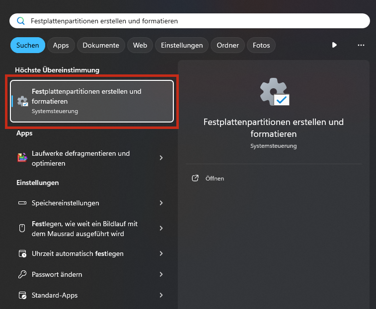
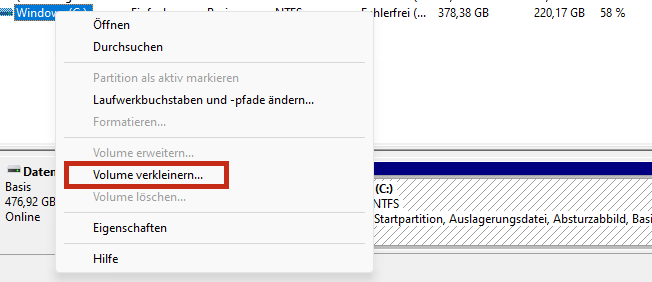
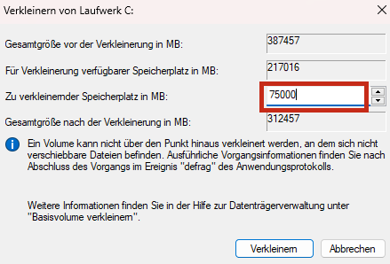
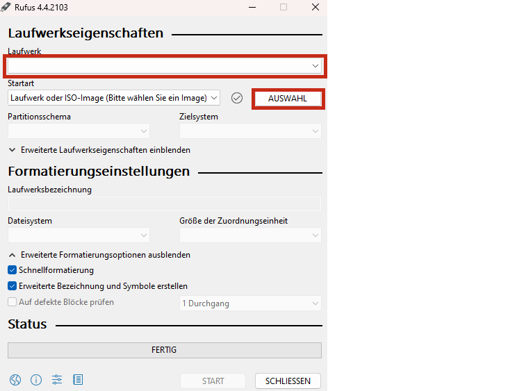

# Overview

This repository contains step-by-step instructions on how to create an Ubuntu partition on a computer and set it up. With exactly the same setup, all ROS scripts are plug-and-play, or can be used after the setup described there.

**Pay attention: Some pictures & screenshots are taken in German. So please pay attention to the exact positions!**

# Table of contents

* [Create Partition & Ubuntu BootStick](#partition--ubuntu-bootstick "Create Partition & Ubuntu BootStick")
* [Installation of Ubuntu](#installation-ubuntu "Installation of Ubuntu")
* [Setting up generals](#general-downloads--settings "Setting up generals")
* [Installation ROS](#installation-ros "Installation ROS")
* [Workspaces & ROS environment](#workspaces--ros-environment "Workspaces & ROS environment")
* [Installation libraries](#used-libraries (Installation libraries))
* [Tips & Information](#tips--information "Tips & Information")

# Partition & Ubuntu BootStick

## Setting up the Ubuntu partition

**This step is only necessary if the partition has not yet been created. This means that if it already exists or the hard drive is still empty, you can skip to the [next step](#creating-the-ubuntu-bootstick "next step").**

1. Open the "Disk Management"-tool
   
2. Select the disk on which you want to create the partition with Ubuntu and right-click the name of it. Select "Shrink Volume"
   
3. Now decide how much space you want to use for your Ubuntu partition. ( We recommend between 50GB-100GB)
   
4. We leave the space free without any partition system or name because for the installation of Ubuntu we need to declare the space on our own. 

## Creating the Ubuntu BootStick

1. Download the [iso-file](https://releases.ubuntu.com/20.04.6/ubuntu-20.04.6-desktop-amd64.iso "iso-file") for Ubuntu 20.04
2. Install software to create bootable mediums, like USB-Sticks, we recommend for this [Rufus](https://github.com/pbatard/rufus/releases/download/v4.4/rufus-4.4_x86.exe "Rufus").
3. Open Rufus and select your device, you want to boot from(**The device, that should be formated and then created to a bootable medium. Pay attention taht you select the right one because the data on it will deleted permanently**). Press the selection button and select your downloaded iso-file. Leave the other boxes, as recommended by Rufus.
   
4. Click on "START" and wait for the finished BootStick.

# Installation Ubuntu

**TODO for Markus**

# General Downloads & Settings

**TODO for Markus**

# Installation ROS

Below we show the step-by-step instructions for installing ROS. At the end there will also be an explanation for a script that completely installs and compiles ROS. **TODO for Markus**

Setup your computer to accept software from packages.ros.org
```bash
sudo sh -c 'echo "deb http://packages.ros.org/ros/ubuntu $(lsb_release -sc) main" > /etc/apt/sources.list.d/ros-latest.list'
```
Install curl
```bash
sudo apt install curl
```
Set up your keys
```bash
curl -s https://raw.githubusercontent.com/ros/rosdistro/master/ros.asc | sudo apt-key add -
```
Put your system up-to-date
```bash
sudo apt update
```
Install the ros desktop-full kit
```bash
sudo apt install ros-noetic-desktop-full
```
Source the setup-Script 
```bash
source /opt/ros/noetic/setup.bash
```
Configurate your Terminal
```bash
echo "source /opt/ros/noetic/setup.bash" >> ~/.bashrc
```
Apply the configuration
```bash
source ~/.bashrc
```
Install dependencies
```bash
sudo apt install python3-rosdep python3-rosinstall python3-rosinstall-generator python3-wstool build-essential
```
Install python3-ros dependencies
```bash
sudo apt install python3-rosdep
```
Initialize the dependencies
```bash
sudo rosdep init
```
Update the dependencies
```bash
rosdep update
```

Now ROS is perfectly installed and you can add the workspaces and other libraries we need.

# Workspaces & ROS environment
**TODO for Markus**

# Used libraries
**TODO for Markus**

# Tips & Information
**TODO for Markus (Script)**